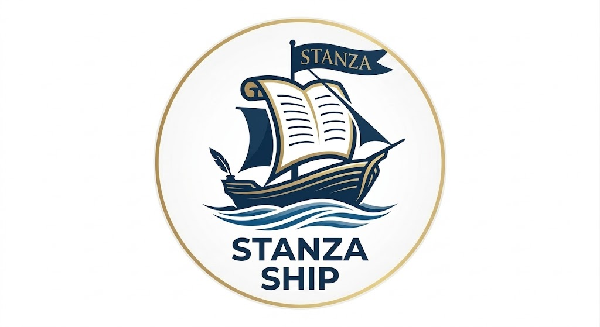
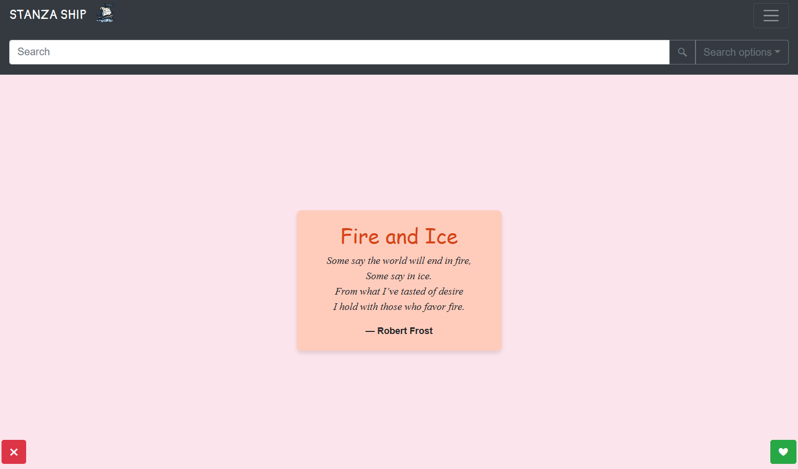
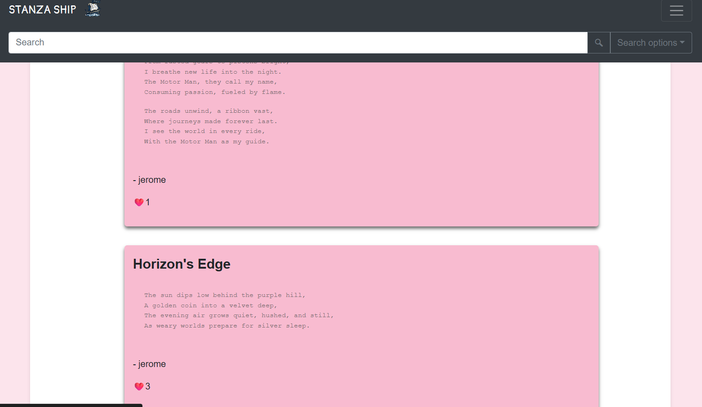
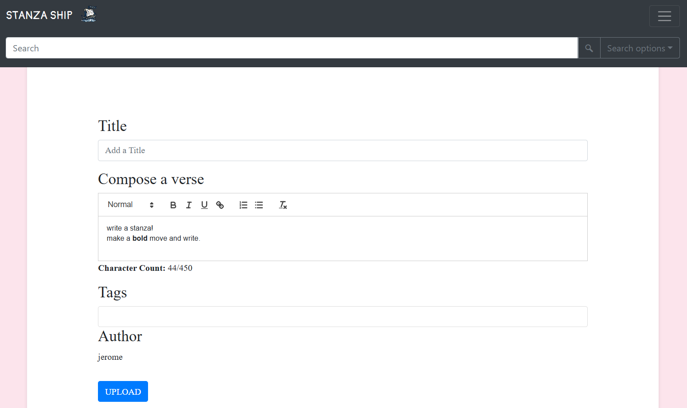

#  Stanzaship⛵

  
 


> *Where words set sail.*

A platform designed for crafting, sharing, and exploring poetry online — connecting writers and readers in a vibrant digital space. Stanzaship gives poets the tools to compose, publish, and discover works in a community built around the art of the written word.

---

## ✨ Features

- **Compose** — Write and format poetry with a rich text editor
- **Publish** — Share your work with a wider audience instantly
- **Discover** — Explore poems by tags, authors, and themes
- **Tagging System** — Organise and find poems by mood, style, or topic

---

## 🛠️ Tech Stack

| Layer | Technology |
|-------|-----------|
| Backend | Django (Python) |
| Frontend | HTML, Bootstrap 4, Quill.js |
| Database | SQLite / PostgreSQL |
| Auth | Django Auth |
| Styling | Custom CSS + Bootstrap |

---
## Also Available at
- [STANZASHIP](stanzaship.onrender.com)


## 🚀 Getting Started

### Prerequisites

- Python 3.10+
- pip

### Installation

```bash
# Clone the repository
git clone https://github.com/jeromeshaiju/stanzaship.git
cd stanzaship

# Create a virtual environment
python -m venv venv
source venv/bin/activate  # On Windows: venv\Scripts\activate

# Install dependencies
pip install -r requirements.txt

# Apply migrations
python manage.py migrate

# Run the development server
python manage.py runserver
```

Then open [http://localhost:8000](http://localhost:8000) in your browser.

---

## 📁 Project Structure

```
stanzaship/
├── main/               # Core app (poems, tags, views)
    ├── templates/          # HTML templates
    ├── static/             # CSS, JS, images
├── stanzaship/         # Project settings
└── manage.py
```

---

## 🤝 Contributing

Pull requests are welcome. For major changes, please open an issue first to discuss what you'd like to change.

---

## IMAGES
 
 
 


## 📜 License

This project is licensed under the MIT License.

---

<p align="center">Made with ❤️ and a love for poetry</p>
